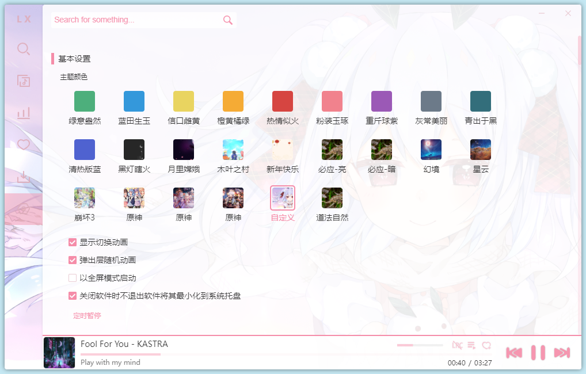

# 洛雪音乐主题包

- 截图

- 已有主题：

  - 必应（亮，暗）
  - 幻境
  - 星云
  - 崩坏3
  - 原神（3张）
  - 自定义（使用方法见本文最后

- 下载地址： [网盘地址](https://wwc.lanzouw.com/b00vyuxwb) 密码： `glqe`

- 使用方法
  
  1. 下载好app.7z后解压
  2. 将里面的app.asar替换安装目录下\resources\app.asar文件
       - **注意**：如果洛雪在运行中，要将洛雪退出
  3. 重新启动洛雪音乐，设置里面即有新的主题

- 自定义背景使用方法
  
  1. 本地搭建nodejs服务器，调用地址为 `http://localhost:23333`
  2. （可选步骤）在浏览器中打开 [http://localhost:23333](http://localhost:23333) 进行测试，测试结果为跳转到一张图片
  3. 重新启动洛雪音乐
  
  ~~[我是笨狗我还是不会](course.md)~~